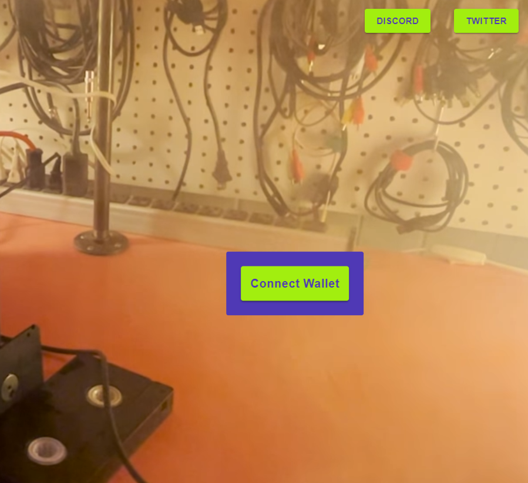

# Minting NFT

When you arrive at the NFT minting website, you will be prompted to Connect Wallet

Click "Connect Wallet" and a menu should pop up. Select "Phantom".

.png>)

You will see a Phantom pop-up prompt like this:

.png>)

Click Connect.

The mint button and your information should be present on the screen.

.png>)

Click Mint A Monster. Another Phantom window will appear to review the transaction.

.png>)

Approve the transaction.

In a few seconds the transaction will have completed, and your NFT should be in your wallet!
